# jvm-gc-logs-analyzer

This project is a Java Virtual Machine and Garbage Collector log analyzer. It is dedicated to JVM 11 and above (JVM 8 support is under development).
**The logs have to be in a proper format with proper decorators**, check sections at
the end for limitations and working examples.

The project creates two artifacts:
* **analyzer-web.jar** - web application that is deployed on [http://gclogs.com](http://gclogs.com)
* **analyzer-standalone.jar** - much faster standalone Swing application 

## How to install - from binaries

Simply download latest [release](https://github.com/krzysztofslusarski/jvm-gc-logs-analyzer/releases).

## How to install - from sources

```shell script
git clone --depth 1 https://github.com/krzysztofslusarski/jvm-gc-logs-analyzer.git
cd jvm-gc-logs-analyzer/
mvn clean package
```

JAVA_HOME should point to JDK 11. 

## How to run

Standalone application: ```java -jar analyzer-standalone.jar```

Web application: ```java -jar analyzer-web.jar```

Java should point to JDK 11.

## Features

### Garbage collector logs analyzer

```
gc*,
gc+stringdedup=debug,
gc+ergo=trace,
gc+age=trace,
gc+phases=trace,
gc+humongous=trace
```

There are multiple charts and tables generated by this tool. I will show in README only the most important one.

#### Garbage collector table statistics

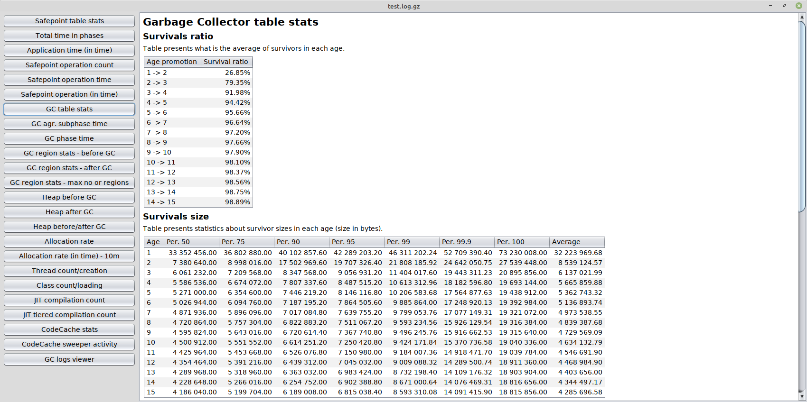
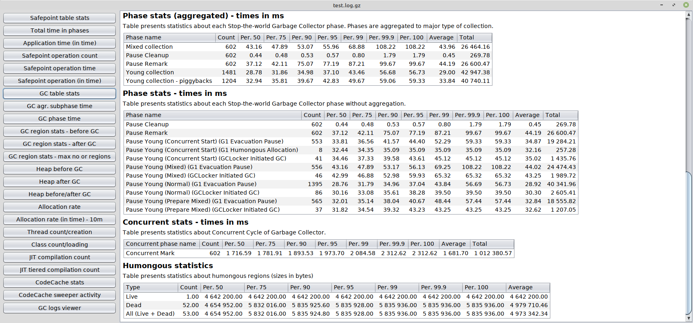

#### Heap before/after garbage collection


#### G1GC max number of regions

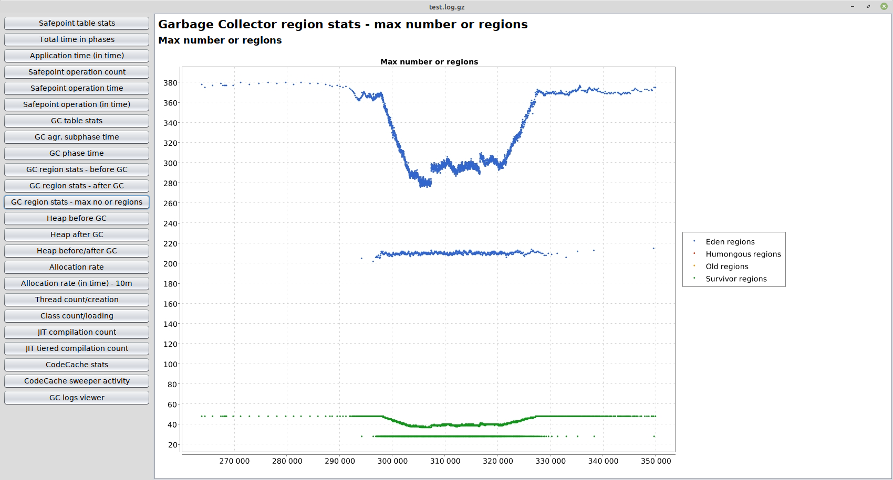

#### Garbage collector phase time


#### Allocation rate

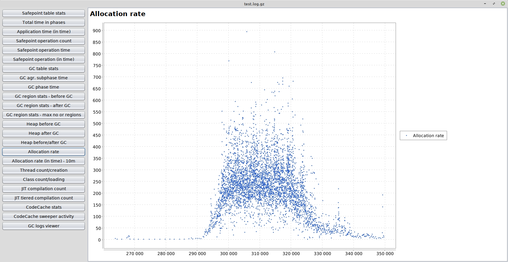

### Safepoint logs anaylzer

```
-Xlog:safepoint
``` 

From safepoint logs this tool will create tables and charts:

#### Safepoint operation statistics

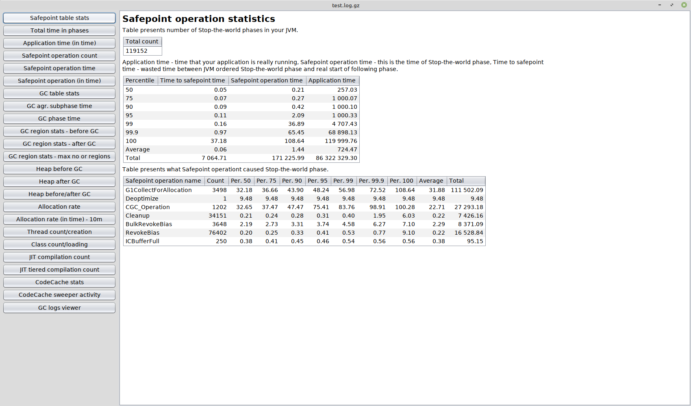

In this table you can find aggregated statistics of:
* each safepoint operation
* time to safepoint

#### Total time in phases

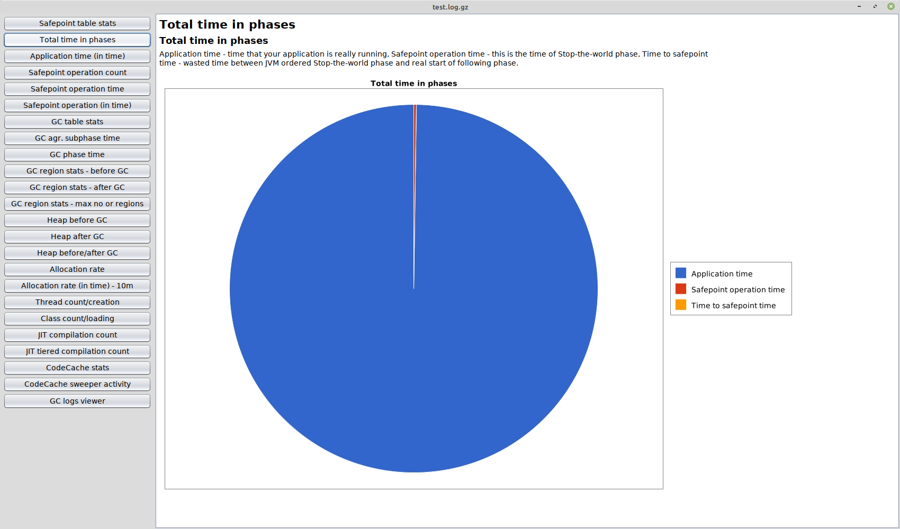

This chart shows how much time your JVM spends in safepoint operation, time to safepoint and in your application.

#### Application time (in time)

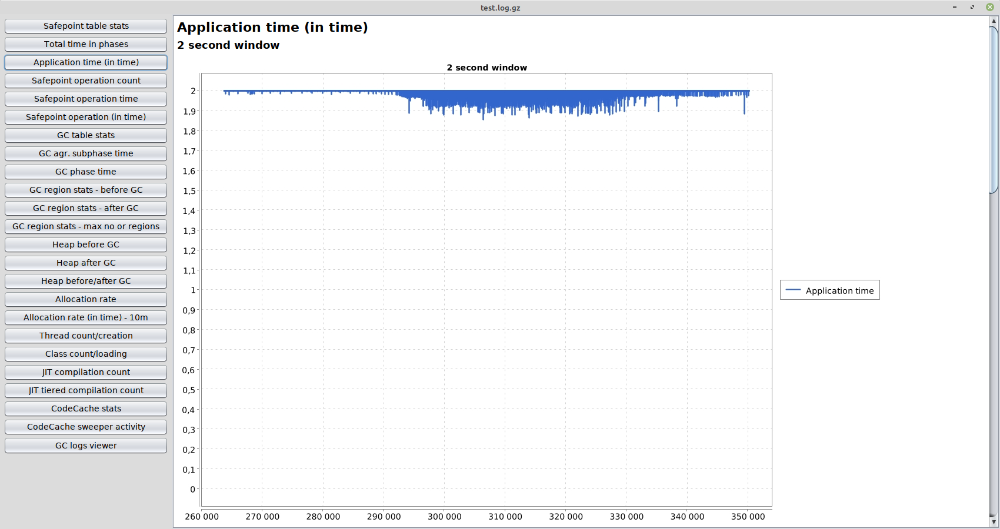

This charts show how much time your JVM spends running your application in 2/5/15 seconds windows.

#### Safepoint operation count

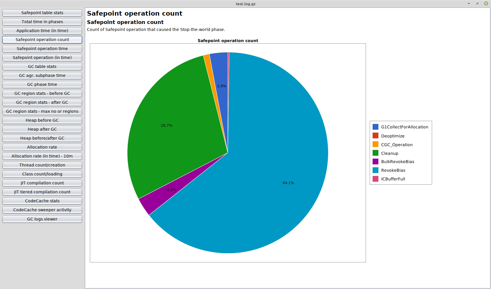

This chart shows distribution of safepoint operation count.

#### Safepoint operation time

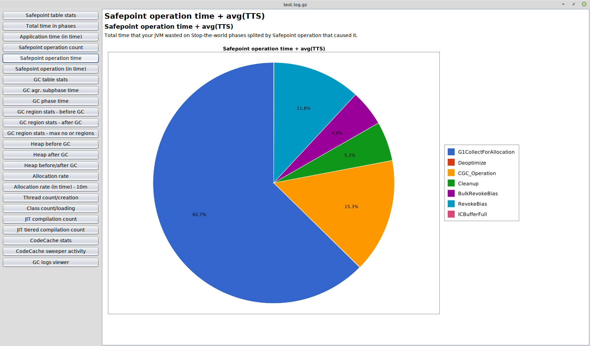

This chart shows distribution of time between each safepoint operation.

#### Safepoint operation (in time)

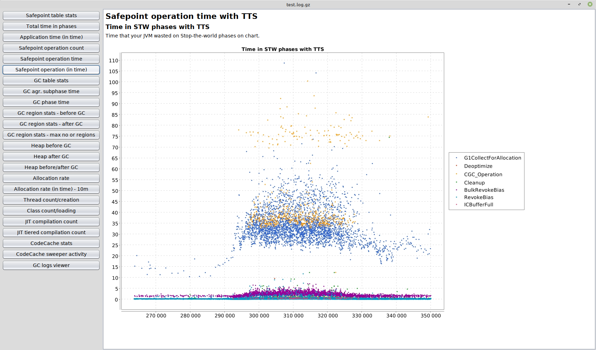

This chart shows distribution of safepoint operation in time.

### Classloader logs analyzer

```
-Xlog:class+unload,class+load
``` 

From classloader logs this tool will create charts:

#### Current class count and class loading activity

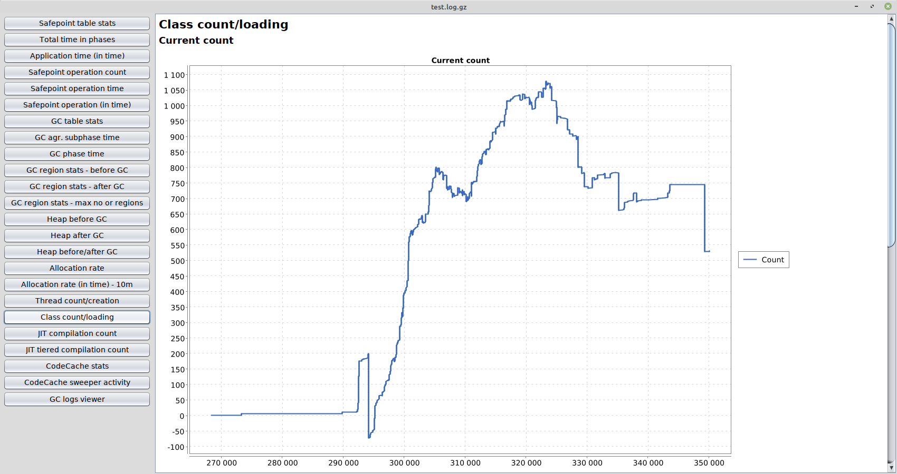


### Thread logs analyzer

```
-Xlog:os+thread
```

From OS thread logs this tool will create charts:

#### Current thread count and thread creation activity

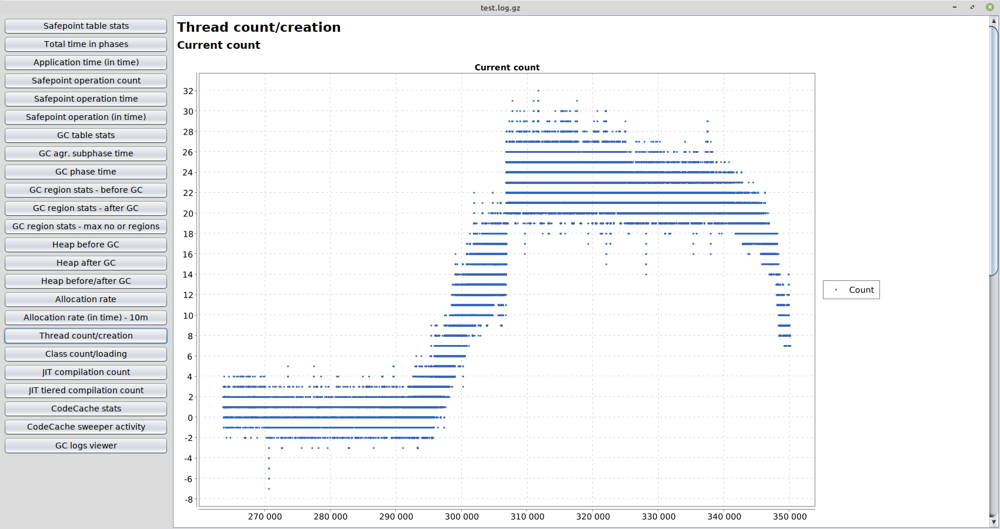

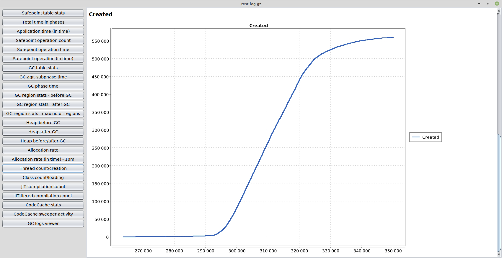

### Compilation logs analyzer

```
-Xlog:jit+compilation=debug
```

From JIT compilation logs this tool will create charts:

#### Current compilation count with and without tier distinguish

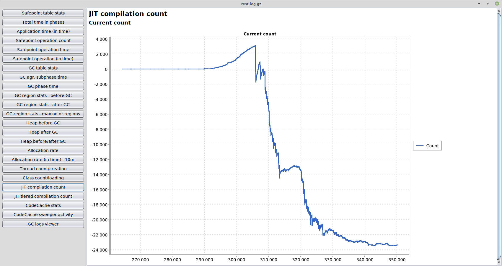

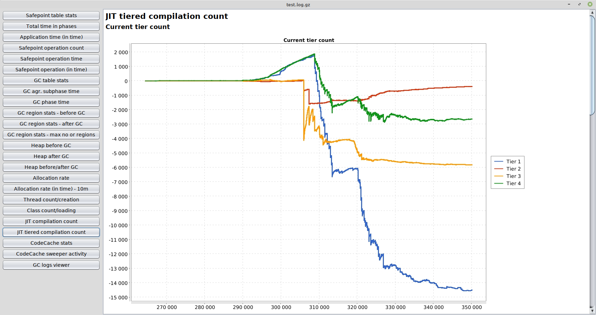

### Code cache and sweeper logs analyzer

```
-Xlog:codecache+sweep*=trace
```

From code cache and sweeper logs this tool will create charts:

#### Current code cache size

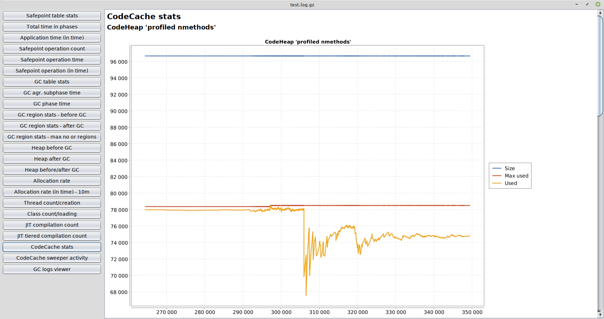

#### Sweeper activity

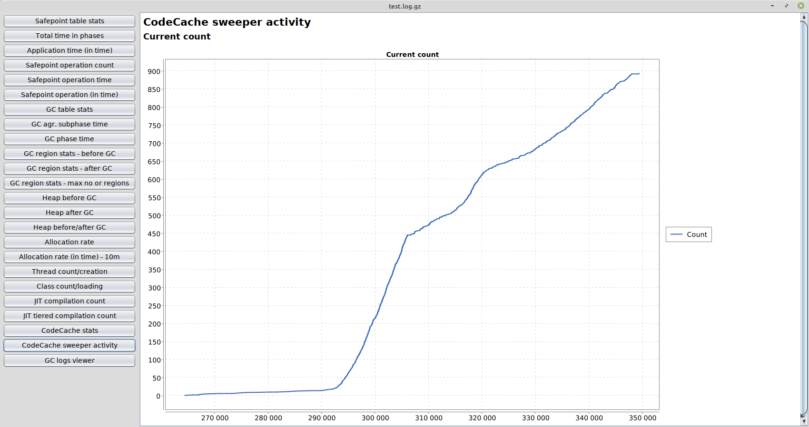


## JVM Xlog configuration

I recommend to use following Xlog configuration
```
-Xlog:codecache=info,
codecache+sweep*=trace,
class+unload,
class+load,
os+thread,
safepoint,
gc*,
gc+stringdedup=debug,
gc+ergo=trace,
gc+age=trace,
gc+phases=trace,
gc+humongous=trace,
jit+compilation=debug
:file=/tmp/app.log
:level,tags,time,uptime
:filesize=104857600,filecount=5
```

If you want to change Xlog configuration on runtime, you can do it with:
```
sudo -u JVM_USER jcmd `pgrep -x java` VM.log
output="file=/PATH/TO/gc.log"
output_options="filesize=104857600,filecount=5"
what="codecache=info,codecache+sweep*=trace,class+unload,class+load,os+thread,safepoint,gc*,gc+stringdedup=debug,gc+ergo=trace,gc+age=trace,gc+phases=trace,gc+humongous=trace,jit+compilation=debug"
decorators="level,tags,time,uptime,pid
```

## Current limitations:

* Logs from JDK 11, 12, 13 - works with flags below, tested on Parallel, CMS and G1.
* Logs from JDK 9, 10 - should work.
* Logs from JDK 8 and below - experimental (GC and safepoints log support, charts and stas are not accurate, because this logs sucks), 
  tested on Parallel and G1, **doesn't work with CMS**
* For JDK 11+ decorators: level,tags,time,uptime are needed, check sample Xlog configuration above.
* UI is optimized for Full HD resolution.
* There is no exception handling at all :) 

## How to contribute

* If you have any idea what other charts/tables I can add please create an issue with explanation why this new feature may be helpful
* If you have logs that doesn't work create an issue with logs included
